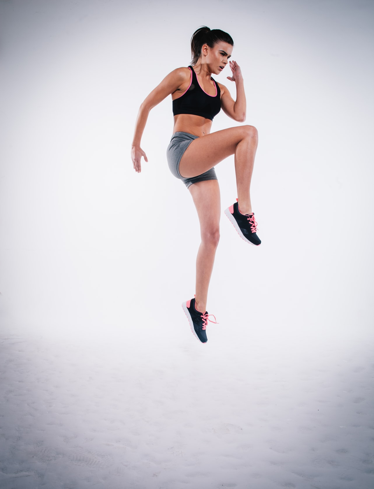

Coronavirus halted us still in our tracks. All stop was declared on our schooling, hobbies, socializing and all sorts of activities.
Only a week ago I wrote about how [I was still going to the gym](https://maggiesfitness.net/going-to-the-gym-coronavirus/). Yet, a week ago in these circumstances feels like a lifetime ago. 
The day I published that post was also the last day I went to the gym. I've been staying home ever since. The gym cancelled all group classes two days later and finally 
closed entirely on Sunday.

### Working out at home
So this left me in the same situation as millions of other people - we need to work out at home. Staying in shape is gonna be absolutely critical for overcoming
this disease if I get infected. I live in an apartment and don't have any equipment nor a lot of space to work out. Luckily, just before this craziness started, I bought a skipping rope and some bands. I try to get 
10-15 minutes of skipping rope outside and then do bodyweight exercises at home. Yesterday I've learned that I need 186 lunges per leg to reach failure :joy:

### Home workouts - for free
A question asked a lot these days is - what are some of the best at-home workout programs out there? A bunch of athletes are coming up with this now
or giving out their existing programs for free. So I decided to compile a list of things that I've tried or heard of that might be useful:

#### 1. Athlean-X at home workout program
Jeff Cavaliere needs no introduction. An absolute legend, he just made a [full-body at-home workout program](https://www.youtube.com/watch?v=vc1E5CfRfos). Exercises easily scalable from beginner to a more advanced level. Note: It requires a pull-up bar.
I am currently following this program, substituting pull-ups for bent-over rows with a band.
Note: Athlean-X also has a paid, no-equipment needed, [program](https://athleanx.com/xero), but it's TOUGH and not great for beginners.

#### 2. Les Mills free trial
The makers of Bodypump, [Les Mills](https://www.lesmillsondemand.com/) offer a 30-day free trial on all of their programs. 
Still not convinced you should sign up for something that they want to charge you for later? Try this [dance class](https://www.youtube.com/watch?v=Srd6TwU6UoI) or this brutal [cardio HIIT](https://www.youtube.com/watch?v=ZMO_XC9w7Lw) workout, 
both featuring beautiful Nina Dobrev.

#### 3. Down Dog
Popular yoga app, [Down Dog](https://www.downdogapp.com/) made all of their apps free until Apr 1st.

#### 4. Yoga With Adrienne
If you've never been much into yoga, but would love to try it - [Yoga with Adrienne](https://www.youtube.com/user/yogawithadriene) is an excellent Youtube channel, 
with videos lasting between 15-30 minutes, very well suited for beginners.

#### 5. Some insane core workout
Ready to hit some core? [This workout](https://www.youtube.com/watch?v=dJlFmxiL11s) will get you sweating in no time and leave your core sore for a while.

#### 6. Hybrid Athlete workout program
[This workout program](https://thehybridathlete.com/bodyweight-training-plan/) from Hybrid Athlete is completely free, and pretty good for anyone looking to stay active indoor.

#### 7. Home Workout - No Equipments
Home Workout - No Equipments is a mobile app that is always free, has a beautiful interface and really good workouts. You should keep it on your phone even after covid-19 craziness is over.
Link for [Android](https://play.google.com/store/apps/details?id=homeworkout.homeworkouts.noequipment&hl=en) and [iOS](https://apps.apple.com/us/app/home-workout-no-equipments/id1313192037)

### Know of more?
I hope you find this useful for staying fit in these horrible times. Know of more? Leave a comment and I'll include them here! Stay safe.
