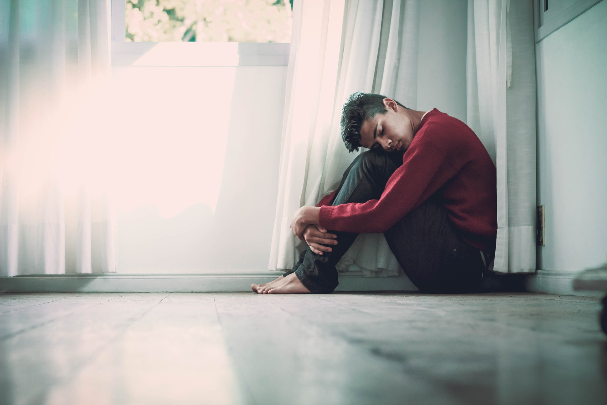

While this is primarily a fitness blog, mental state plays an important part in our overall well-being and it is fair I address it here. 
The uncertainty of this situation brings a lot of anxiety. For most of us, our primary resource of dealing with anxiety - the gym - is not available at the moment. 
I'm not going to lie, I've had some really bad days over the past few weeks, which caused me to develop new coping mechanism. I'm sharing them with you:

### Understanding the reasons why we're staying at home
I see a lot of people getting frantic with worry of getting infected, afraid to go the supermarket even. I understand that the thought of contracting a virus causes a lot of anxiety.
But the truth is: there is no vaccine in sight yet and there's not gonna be one soon. We'll need to resume (at least some of) our activities eventually, and with this thing being so infectious, we'll all get infected sooner or later. 
Chances are if you're young and healthy (and since you're into fitness, you're in a better starting position), you will be just fine.

We're staying inside to protect the vulnerable among us - the elderly, people with respiratory issues, chemo patients and to give medical staff the best chance of treating those vulnerable ones.
Remember, it's not about YOU, it's about OTHERS. Abandon the "what can I do not to get it" mindset and adopt the "I probably already have it, what can I do not to spread it" mindset. 
It will alleviate a great deal of anxiety.

### Cleaning the house
Since now we're inside all the time, it's more important than ever to keep the house clean. My partner and I developed a daily routine of cleaning the kitchen and the bathroom.
Every third day we vacuum clean and mop the floor. Twice a week we do laundry. We're more thorough with house work than ever before. Cleaning the house has a double benefit: it keeps me occupied for a while and
being in a clean house makes me less itchy and more calm.

### Working
If you can work from home, you are a lucky one. I've been working from home even before all of this started, so I already have a routine developed, but that doesn't mean my routine didn't get disrupted with all this. 
I know that for many people the whole working-from-home concept came as a shock (especially to people with children) and they are still adjusting. 
It takes some time to get used to, but it's doable. Keep strict boundaries between work and home life. Do not bring work-induced troubles in the mix. Understand your colleagues - everyone is struggling and doing their best in these circumstances. 
For me, having a steady source of income takes one worry away in these times of uncertainty. Additionally, focusing on work makes me feel like at least *something*
is under my immediate control.  

### Baking
I've always found baking a very soothing activity. I haven't done it a lot lately, mostly cause I have a small kitchen and can't manoeuvre as much as I'd like to while baking. Slowly, 
I've been rediscovering my love for baking, experimenting a lot, not following any recipes, just mixing stuff together and seeing how it will turn out. 
Here's my latest experimet: whey-cocoa-almond butter muffins I made on Sunday. Not the nicest-looking ones (although they were delicious). 
They grew much more than I expected, overflowing the container. But it was a fun experiment and now I know better for the next time.

### Cooking 
My meals are usually super simple - some meat, some veggies and some carbs. Some people call it bland, I say it's quicker to make and easier to track macros that way. 
Under normal circumstances, I food prep once every 2-3 days, and have food ready for when I need it. Now with extra time on my hands and shortages of some of my favorite products (goodbye eggs),
I'm learning to be more creative in the kitchen (the other day I made my first-ever tofu curry). I'm looking for ways to get creative while not totally ruining my macros.
Hoping to post some culinary experiments here soon. 

### Coloring book
Two weeks ago I ordered a coloring book on Amazon, and I can't believe how did I ever live without it. It is so soothing that you won't notice 2-3 hrs passed by in a flash.
Seriously, everyone needs a coloring book. 

### Music
Music is in general one of my main coping mechanisms. I have a record player. In my case, a record is never used as a background noise for other activities. When a record is playing,
it means it's music time. I pour myself some whiskey, sit on the floor and immerse myself in a world the musician tried to create for us. It just me and the tunes. 
Even if you don't have a record player, set some time aside to listen to music. Just listen.

### Exercising
The gyms may be closed, but it's still important to stay active. In fact, it's MORE important now than ever. There are a lot of things you can do at home. 
If you are looking for ideas, you can have a look at one of my [previous blog posts](https://maggiesfitness.net/exercising-in-time-of-the-coronavirus/).

Stay safe and take care. 
