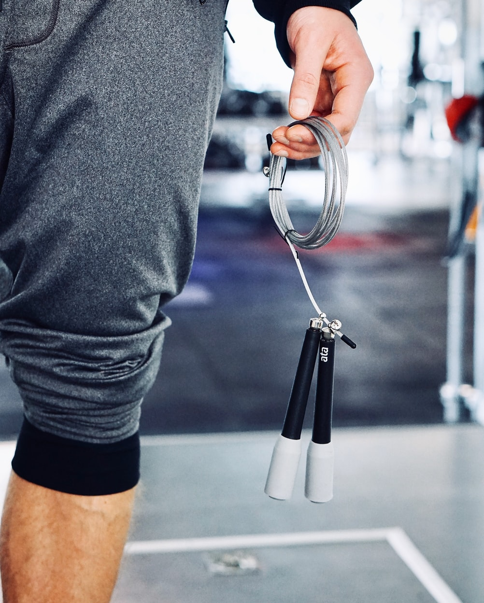
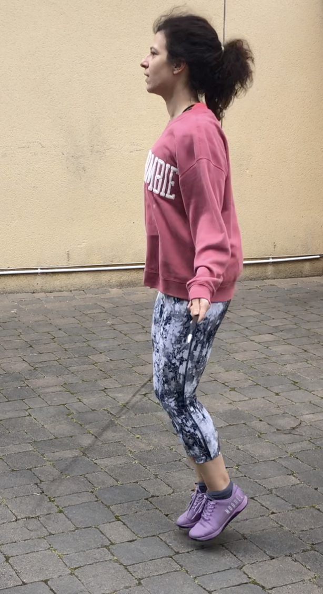

Even before the covid-19 quarantine started, I began incorporating skipping rope in my workouts. It is great for a quick warmup before the main workout session
or as a standalone and fun cardio workout. For me it has two additional benefits: it improves the coordination, which I'm really bad at and strengthens
the calves, which I'm also notorious for neglecting. Also, a while ago I thought how it would also be great for traveling - it fits even in the tiniest carry-ons and
it would allow me do a quick cardio workout wherever. I guess that's not an issue currently :cry: Nowadays, with the quarantine rules getting
stricter and stricter every day, it's even more valuable. I normally just go in front of my building and do a jumping session there. If you don't have neighbours below you, 
you can even do it in your living room.

### The basics
To get started, you'll need - well, a skipping rope. Avoid big, heavy sturdy ones, or the ones for kids. Invest in a proper skipping rope, something a bit more durable.
Make sure the length can be adjustable. Personally, I got [Bear Grip skipping rope](https://www.amazon.co.uk/BEAR-GRIP-Conditioning-Self-Locking-Aluminium/dp/B07ZRZ9WYH) from Amazon, 
but there are many similar products out there. Regarding this specific one, it's pretty decent, but not super high quality. It gets tangled easily and it's already wearing out, although 
I've only had it for 2 months or so (I do use it almost daily though). On the plus side, it comes with a replacement rope, so I might make use of that soon. 
In addition to a skipping rope, you will need shoes. Do not attempt skipping barefoot, as it will mess up your tendons badly. I usually wear my all-round gym shoes (NoBull) that will do the job just fine,
but lately, since starting to jump more, I've been wearing my running shoes. They are a bit more cushioned and provide better protection for the tendons. 

### Setting it up
The skipping rope must not be too short nor to long. The length of the folded rope should be up to your armpit. Take some time, jump around, experiment with
the length before you screw it tight and this goes especially if you get one of those ropes that you need to cut. Mine ended up a bit longer than the recommended armpit height. Otherwise I
was tripping on it constantly.

### The technique
If you are like me, and haven't jumped since you were a kid, the chances are you will do this terribly when you start. It's expected. I've built up a solid
endurance on the skipping rope and still don't have the technique right. Some golden rules to follow - jump low, land as softly as possible, keep on your toes always. 
Keep your wrists close to the body, rotate just the wrists, the entire upper body should keep still. [This video](https://www.youtube.com/watch?v=FJmRQ5iTXKE&t=159s) explains the technique 
really well and helped me immensely. And as always - practice, practice, practice.

### Jumping
Now for the fun stuff. As always, if beginning a new training regimen, easy into it. Jumping is quite taxing on the tendons and if you're tendons are not used 
to it, try not to do jump for more than a few minutes a days. To begin with, hops with both feet are the easiest for getting the technique right, 
getting a grip of it all, and building endurance. Alternating leg hops require slightly more coordination but will allow you to catch a breath a bit more easily.
Single leg jumps are at the same time worst for me and the best for me, to strengthen that lazy left leg. You can jump side to side, single-leg side to side or get even 
more creative.

### My workout 
As I mentioned, my endurance has really improved, so I can do solid jumping with only slight breaks in between. I always aim
for at least 50 jumps in a row, regardless of what I'm doing. This is what I did today:
4 rounds of: 
* 200 slow alternating-leg hops (warmup)
* 100 two-foot hops 
* 200 regular-pace alternating hops
* 50 single leg hops (each leg)
* 50 fast two-foot hops
* 1 min break

Here's a photo of me skipping:

### Stretch
As after any workout, don't forget to stretch, especially those calves :smiley: I usually do the same stretch routine as I do after a run.
Example: 
* push the wall away 
* seated calf stretch with a band
* downward-facing dog
* seated hammstring stretch 

####
Do you like skipping rope workouts? Let me know in the comments. 

####
Stay safe and stay active. 
