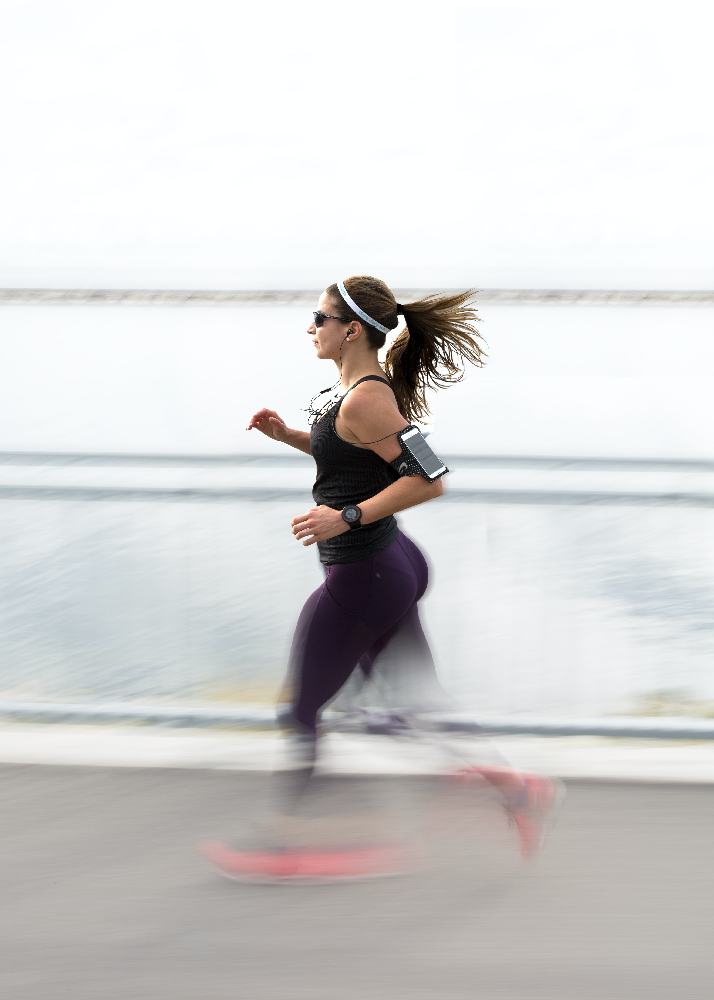
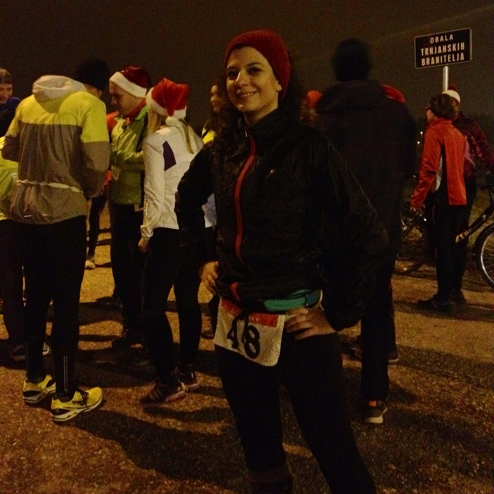

In case you didn't know, before I became a gym rat, I was a passionate runner. Fully serious about it. 
In fact, I think I had been more serious about running than I have ever been about weightlifting. 
I was in a runner's club, doing regular trainings 3-4 times a week, with some cross-training in between. 
Few things allow me to clear my mind like running does. It's such a zen-like activity. I like to say - running is for the mind, weightlifting is for the body.
####
With the gyms closed and quarantine rules in place, I see a lot of people (me including) have picked up running. 
Seeing that, I thought I'd share some tips from my years of running, followed by an awesome 0 - 5k program.

### Ease into it
I know this goes for pretty much every activity, but it's especially important for running. Running is very taxing on your body. 
When you are running, in that moment you land, the weight of your entire body is taken by a single point in your foot. Your tendons and muscles need to get used to this movement. 
Unless you are an experienced runner, I would strongly suggest not to run every day, even if you're otherwise quite fit.

### Good running shoes
I understand a lot of people have lost their jobs or the future of their jobs is uncertain. 
However, if you can financially, invest in good running shoes. Good running shoes are the ones that are good for **you**. A lot of stores have dedicated sections for trying on running shoes.
 Some will let you run on a treadmill for a bit. Some will even allow you to take the shoes for a run around the building. 
 Obviously, none of that is available at the moment, so you will have to order online. Try to see what kind of a strider you are - heel, midfoot, front foot. Do some research online based on what you know about your running and try to make the best guess. 
 Personally, I have Mizuno Wave and have been using them for years. I just get a new model every time I need to replace my running shoes.

### Optimize for distance, not speed
What I see a lot of new runners trying to do is beat themselves (their spouses, their friends) in how fast they can run, no matter if they can't run for more than 3km\*. They run day after day, trying to be faster than yesterday. Forget the pace. Until you can comfortably run 10km, you shouldn't care about how fast you run. 
Comfortable pace is the one that lets you breathe normally. General rule is - you should be able to maintain a conversation. If you feel you can sing, you're running too slow. 
If you're losing breath and can't even talk, you're running too fast. Talk to yourself if don't have a running partner these days. 
Don't worry, most people will think you're crazy just because you're running in the first place :smiley: Finally, at the end of the run, you should feel tired, but not exhausted.
###
\* I understand that under these circumstances you may only be allowed/have space to run 3km per day. In that case, do whatever you can, what works for you.

### Walking is your friend
This goes side to side with the previous statement. When increasing distance, you'll need to walk a bit inbetween running sections. 
The walking part here is to prolong your total running time, not to make it easier. Use walking time to get the pulse down, breathe a bit, and try to maintain a brisk pace.

### Wear a headband/cap
When running, you will sweat a lot. And I mean A LOT. 
Sweat will be dripping in your face. 
This is distracting even in normal circumstances, but under current circumstances, you will definitely want to avoid touching your face while running. 
Wear a headband, a scarf, a baseball cap - whatever you have available. I usually wear a [Buff](https://www.buff.com/ie/sport/running.html/) - they are not only practical, but also very fashionable.
But as I said, whatever you have will do. Here's a super old photo of me at the night-time race, wearing a headband my mum had made :smiley:

####
Now, with all this said, here's the running program I promised:

### Running program
This was a program developed by my running coach, someone who had run marathons, led a runners club and in short - dedicated his entire life to running.
It's made to get you running safely and injury-free. The first section is always running, followed by a walking section, so it alternates.

***Week1***      
Mon: 22 min (2 min walking, 2 min running, alternate)   
Wed: 23 min (3 + 2 + 3 + 2 + 3 + 2 + 3 + 2 + 3) - start by 3 min running, 2 min walking, 3 min running...   
Sat: 24 min (4 + 2 + 4 + 2 + 4 + 2 + 4 + 2)   

***Week2***   
26 min (5 + 2 + 5 + 2 + 5 + 2 + 5)   
26 min (5 + 2 + 5 + 2 + 5 + 2 + 5)   
30 min (5 + 2 + 7 + 2 + 7 + 2 + 5)  
   
***Week3***   
30 min (5 + 2 + 7 + 2 + 7 + 2 + 5)   
34 min (7 + 2 + 7 + 2 + 7 + 2 + 7)   
36 min (5 + 2 + 10 + 2 + 10 + 2 + 5)   
   
***Week4***    
36 min (5 + 2 + 10 + 2 + 10 + 2 + 5)   
36 min (5 + 2 + 10 + 2 + 10 + 2 + 5)   
36 min (2 + 15 + 2 + 15 + 2)   
   
***Week5***   
26 min (3 + 20 + 3)   
31 min (3 + 25 + 3)   
36 min (3+ 30 + 3)   
   
***Week6***   
5km    
40min 8+2 (8min running + 2min walking)   
6km   

Hope you'll enjoy running and keep at it even after all this is over!

