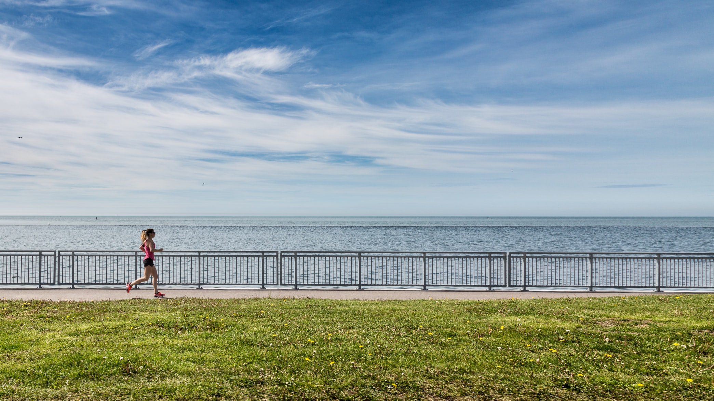
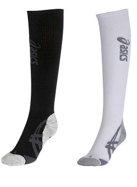
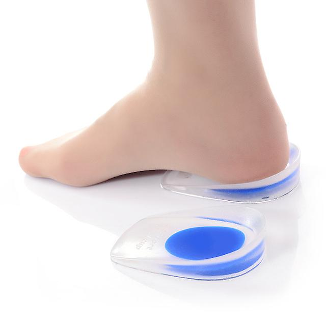

    
I see my [post](https://maggiesfitness.net/running-basics/) about running from last week got quite a bit of attention, but I also noticed there are still some common questions
popping up that I failed to address, so let me try doing so now. But before I start I want to get one thing cleared out - in case you
are a seasoned runner and wondering "where are all these runners coming from", let me tell you: we're coming from the confinement of our homes.
I live in an apartment with no balcony. I need to go outside to get some fresh air. Running allows me to move, to breathe - to feel alive.
It is true that before the quarantine I hadn't been running for nearly two years. It just didn't feel right. Now it does. And I'm not going to apologize
for taking the pavement. There are certain places you can't enter, clubs you can't belong to - but the road, the road is always free.    

Ok, now back to the real stuff.   
#### My stomach gets upset when I run
Runner's diarrhea is a common phenomena even in very experienced runners. During London marathon in 2005, the winner and the previous marathon record holder
Paula Radcliffe sat by the side of the road and defecated, in front of the entire crowd and TV cameras. I'm not gonna post a picture here, but if you're interested, it's easy to Google it.
 Shit happens, quite literally. The scientist still
don't have a concrete explanation for this and it's not clear why it affects runners so much, but not eg. cyclists. However, there are some things that I found useful:
* have a bowel movement before going for a run - self-explanatory, but try timing your run after your bowel movement. I often think of my former colleague who would run
before work, usually around 7 in the morning. He would get up at 5, make himself a coffee and than wait for the coffee to kick in. He wouldn't go for a run until he was ready :smiley:
* don't have coffee before going for a run - I normally have a strong coffee before a weightlifting session. The boost of caffeine is basically my preworkout. 
However, before a run, I don't need this boost, and coffee only make my stomach more upset.
* don't eat at least 3 hours before going for a run - while I normally have a small meal before going to the gym, for a few hours before I run I mustn't have any food.
* avoid food that normally makes you bloated - even if you don't have any food allergies, some food is harder for you body to digest than others. Once I had a full bowl of beans before
going for a run in the afternoon. I don't need to tell you how that ended :smiley:
* wear a pack of tissues - tissues are so small that they fit in any running pouch. I know this is the last resort, but if you really need to go - it will save you a lot of trouble.

### Is it ok to run fasted?
Some people want to avoid stomach problems by running fasted. Recently, I've been hearing from different sides that fasted cardio is bad for you. To be honest with you,
I haven't looked into the matter closely enough to have a balanced opinion and don't want to be giving false advice here. My running coach was definitely recommending NOT to run fasted, as your 
body needs energy for the run. But I haven't actually heard him mention any bad side effects or running fasted. I've certainly run fasted, fasted and hungover, with a small amount of food in me -
and I'm still alive and ok. But if you're really thinking of regularly running fasted, give this some more investigation.

### Shin splints are killing me
I see this as one of the most common problems new runners face. I cannot stress the importance of running shoes enough. Running is the sport that requires really no equipment,
no fancy clothing, no membership fees (unless you want to pay for any of those things, of course). You only need to invest in good running shoes. Please do it. Other than that, ease
into running - don't run every day even if you're otherwise fit. And stretch. Stretch. And stretch some more. 
A useful accessory, if you're willing to invest some money are compression socks (but they won't help you if you have bad footwear). 
These are meant to improve you circulation while running, reduce swelling and speed up muscle recovery. There are full socks available or just sleeves you can wear 
on your regular socks. Again, there's a variety of brands, styles, compression levels, warmth levels...depends on what you need them for and how you intend to use them.
 I have a few compression socks form Asics, very basic ones, something like this:

 
But honestly, I rarely wear them. I guess I'm not a big fan of that soccer-player look :smiley:
 
### My Achilles tendon hurts
This goes side to side with the shin splints. Achilles tendon pain is probably caused by weak calf muscles, which a lot of people (me including) often neglect.
Follow the same advice as before - good footwear and a lot of stretching, but also add some calf muscle strengthening exercises.
I was suffering from Achilles tendon strain a few years back and my doctor recommended silicon gel pads that you put underneath your heel in your running shoe.
This is how it looks like:

Since then, I've kept running with these in my shoes and my tendons have been fine :knocks on wood: But since I started running regularly again,
I stretch my calves 3 times a day, on my running days, as well as on non-running days. I'll write another blog post soon with dedicated calf muscle stretches and 
some calf muscle strengthening exercises, to help you with this further. Stay tuned!

For now, I hope you're all still enjoying running and staying injury free!
